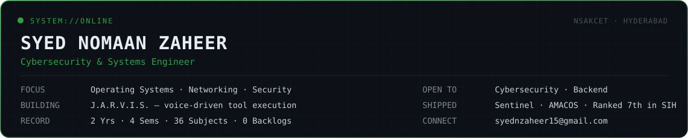

  

  

 

  

 

## About

I got into cybersecurity by wanting to know how things actually break, not the CTF kind, the systems kind: How a Linux box behaves right before it's compromised, how an anomaly looks different from ordinary noise and so on...

That curiosity became **Sentinel**, a distributed Linux monitoring and security platform I built alone from the network layer up. I'm currently working on **J.A.R.V.I.S.**, a voice assistant that doesn't just respond, it calls real tools and gets things done.

Outside solo builds, I led a six-person team through Smart India Hackathon 2025 against senior competitors and secured 7th place. Also, shipped a working multi-agent system in a single 36-hour sprint at Agentathon 2025 - a build that, as an unplanned bonus, ended up part of a Guinness World Records title for the largest agentic AI hackathon on record.

 

## What I've Built

  

  

  

  <b>Sentinel</b> : catches a brute-force attempt or a dead node before you'd notice either yourself. 
  <b>J.A.R.V.I.S.</b> : still building, already routes real spoken requests to real tool calls. Memory and wake-word are what's left. 
  <b>AMACOS</b> : delivered a working, judge-facing demo inside a 36-hour window, not just a design doc.

 

<table align="center">
  <tr>
    <td><b>Currently Building</b></td>
    <td>J.A.R.V.I.S. - Routing works end to end, memory and wake-word detection are what's left</td>
  </tr>
  <tr>
    <td><b>Currently Learning</b></td>
    <td>Operating Systems, Computer Networking, and Cloud Security in more depth</td>
  </tr>
  <tr>
    <td><b>Open to</b></td>
    <td>Internships in Cybersecurity, Backend Engineering, Systems, and Infrastructure</td>
  </tr>
  <tr>
    <td><b>Ask me About</b></td>
    <td>Python, Flask, Linux, Networking, System Design, Threat Detection</td>
  </tr>
  <tr>
    <td><b>Off-Record</b></td>
    <td>2 Years, 4 Semesters, 36 Subjects, 0 Backlogs - Still Building</td>
  </tr>
</table>

 

## Stack

  
  
  
  
   
  
  
  
  
   
  
  
  
  
   
  
  
  
  
  

 

## Elsewhere

  
  
  

 

  
  

  

